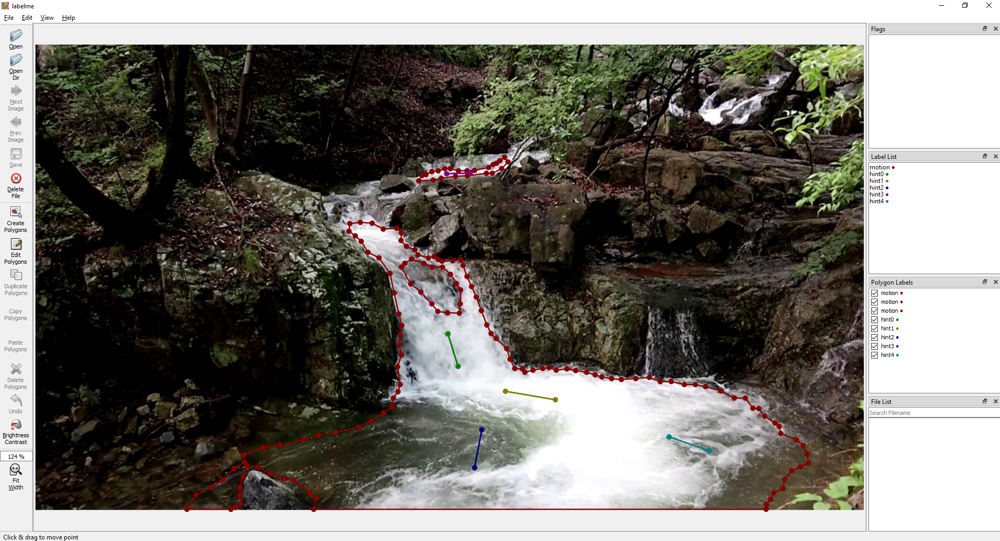

# 3D Cinemagraphy from a Single Image (CVPR 2023)
[Xingyi Li](https://scholar.google.com/citations?user=XDKQsvUAAAAJ&hl)<sup>1,3</sup>,
[Zhiguo Cao](http://english.aia.hust.edu.cn/info/1085/1528.htm)<sup>1</sup>,
Huiqiang Sun<sup>1</sup>,
[Jianming Zhang](https://jimmie33.github.io/)<sup>2</sup>,
[Ke Xian](https://sites.google.com/site/kexian1991/)<sup>3*</sup>,
[Guosheng Lin](https://guosheng.github.io/)<sup>3</sup>

<sup>1</sup>Huazhong University of Science and Technology, <sup>2</sup>Adobe Research, <sup>3</sup>S-Lab, Nanyang Technological University

### [Project](https://xingyi-li.github.io/3d-cinemagraphy/) | [Paper](https://github.com/xingyi-li/3d-cinemagraphy/blob/main/pdf/3d-cinemagraphy-paper.pdf) | [arXiv](https://arxiv.org/pdf/2303.05724.pdf) | [Video](https://youtu.be/sqCy7ffTEEY) | [Supp](https://github.com/xingyi-li/3d-cinemagraphy/blob/main/pdf/3d-cinemagraphy-supp.pdf) | [Poster](https://github.com/xingyi-li/3d-cinemagraphy/blob/main/pdf/3d-cinemagraphy-poster.pdf)

This repository is the official PyTorch implementation of the CVPR 2023 paper "3D Cinemagraphy from a Single Image".

# Installation
```
git clone https://github.com/xingyi-li/3d-cinemagraphy.git
cd 3d-cinemagraphy
bash requirements.sh
```

# Usage
Due to
Download pretrained models from [Google Drive](https://drive.google.com/file/d/1ROxvB7D-vNYl4eYmIzZ5Gitg84amMd19/view?usp=sharing), then unzip and put them in the directory `ckpts`.

To achieve better motion estimation results and controllable animation, here we provide the controllable version. 

Firstly, use [labelme](https://github.com/wkentaro/labelme) to specify the target regions (masks) and desired movement directions (hints): 
```shell
conda activate 3d-cinemagraphy
cd demo/0/
labelme image.png
```
A screenshot here:


It is recommended to specify **short** hints rather than long hints to avoid artifacts. Please follow [labelme](https://github.com/wkentaro/labelme) for detailed instructions if needed.

After that, we can obtain an image.json file. Our next step is to convert the annotations stored in JSON format into datasets that can be used by our method:
```shell
labelme_json_to_dataset image.json  # this will generate a folder image_json
cd ../../
python scripts/generate_mask.py --inputdir demo/0/image_json
```
We now can create 3D cinemagraphs according to your preference:
```shell
python demo.py -c configs/config.yaml --input_dir demo/0/ --ckpt_path ckpts/model_150000.pth --flow_scale 1.0 --ds_factor 1.0
```
- `input_dir`: input folder that contains src images.
- `ckpt_path`: checkpoint path.
- `flow_scale`: scale that used to control the speed of fluid, > 1.0 will slow down the fluid.
- `ds_factor`: downsample factor for the input images.

Results will be saved to the `input_dir/output`.

# Known issues
- Due to the limited size of the training dataset, the intermediate frame may occasionally experience flickering. 
- The utilization of a fixed distance threshold in agglomerative clustering within the disparity space can occasionally result in the presence of visible boundaries between different layers.
- We may sometimes see artifacts when the fluid is moving very fast. You can either slow down the fluid by increasing the `flow_scale` or try to specify short hints rather than long hints, to avoid artifacts.
- The motion estimation module occasionally generates motion fields that do not perfectly align with the desired preferences.

# Citation
If you find our work useful in your research, please consider to cite our paper:
```
@InProceedings{li2023_3dcinemagraphy,
    author    = {Li, Xingyi and Cao, Zhiguo and Sun, Huiqiang and Zhang, Jianming and Xian, Ke and Lin, Guosheng},
    title     = {3D Cinemagraphy From a Single Image},
    booktitle = {Proceedings of the IEEE/CVF Conference on Computer Vision and Pattern Recognition (CVPR)},
    month     = {June},
    year      = {2023},
    pages     = {4595-4605}
}
```

# Relevant works
- [Animating Pictures with Eulerian Motion Fields](https://openaccess.thecvf.com/content/CVPR2021/papers/Holynski_Animating_Pictures_With_Eulerian_Motion_Fields_CVPR_2021_paper.pdf), CVPR 2021
- [Controllable Animation of Fluid Elements in Still Images](https://openaccess.thecvf.com/content/CVPR2022/papers/Mahapatra_Controllable_Animation_of_Fluid_Elements_in_Still_Images_CVPR_2022_paper.pdf), CVPR 2022
- [Simulating Fluids in Real-World Still Images](https://arxiv.org/pdf/2204.11335), arXiv 2022
- [3D Photography using Context-aware Layered Depth Inpainting](https://openaccess.thecvf.com/content_CVPR_2020/papers/Shih_3D_Photography_Using_Context-Aware_Layered_Depth_Inpainting_CVPR_2020_paper.pdf), CVPR 2020
- [3D Photo Stylization: Learning to Generate Stylized Novel Views from a Single Image](https://openaccess.thecvf.com/content/CVPR2022/papers/Mu_3D_Photo_Stylization_Learning_To_Generate_Stylized_Novel_Views_From_CVPR_2022_paper.pdf), CVPR 2022
- [3D Moments from Near-Duplicate Photos](https://openaccess.thecvf.com/content/CVPR2022/papers/Wang_3D_Moments_From_Near-Duplicate_Photos_CVPR_2022_paper.pdf), CVPR 2022
- [3D Video Loops from Asynchronous Input](https://openaccess.thecvf.com/content/CVPR2023/papers/Ma_3D_Video_Loops_From_Asynchronous_Input_CVPR_2023_paper.pdf), CVPR 2023


# Acknowledgement
This code borrows heavily from [3D Moments](https://github.com/google-research/3d-moments) and [SLR-SFS](https://github.com/simon3dv/SLR-SFS). We thank the respective authors for open sourcing their methods.
